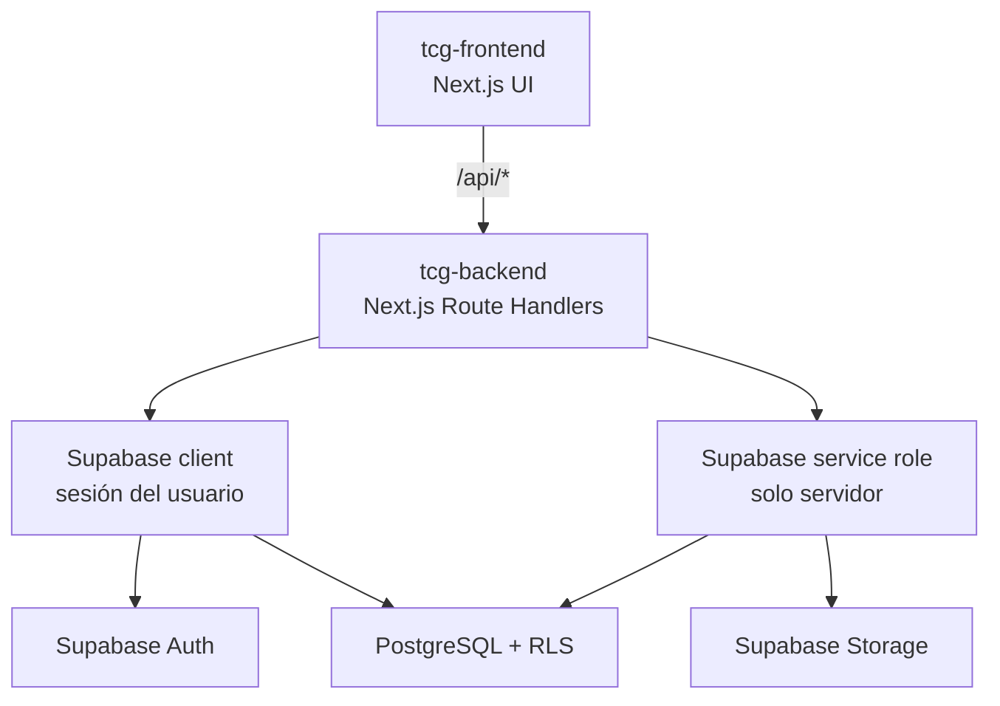
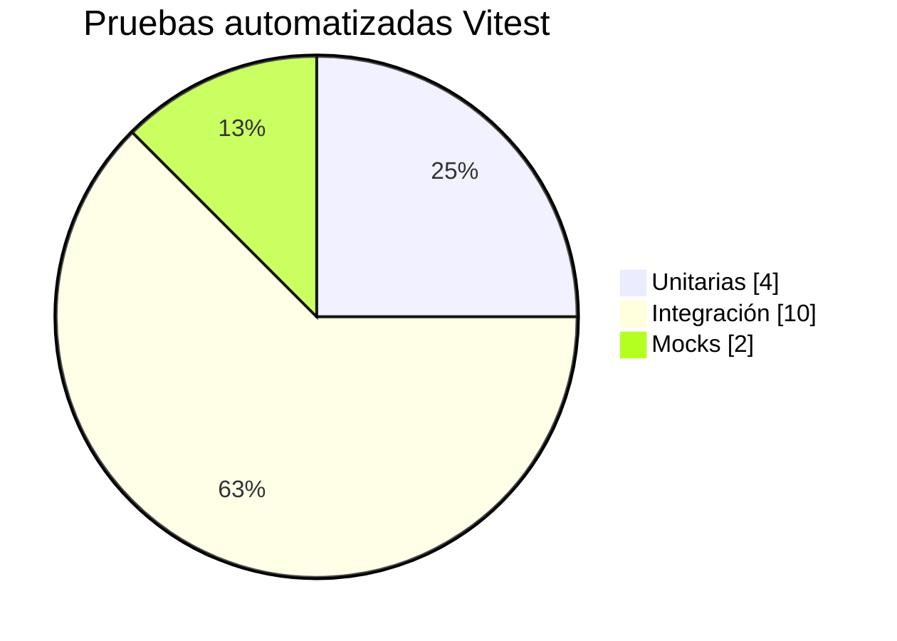

# TCG Hub — Backend


API de **TCG Hub / TCG Tournaments**, plataforma para descubrir, publicar e inscribirse en torneos de Trading Card Games en Chile.

Este repositorio concentra los endpoints, reglas de autenticación, acceso a Supabase, operaciones administrativas, migraciones y pruebas técnicas. El frontend vive separado en el repositorio `tcg-frontend`.

## Qué resuelve

La API permite operar el producto completo:

- Autenticación, registro, recuperación y actualización de perfil.
- Publicación, edición y consulta de torneos.
- Gestión de tiendas organizadoras.
- Inscripción de jugadores a torneos.
- Lookups de catálogos: juegos, categorías y ciudades.
- Panel administrativo con métricas, usuarios recientes, tiendas, borradores y control de roles.

## Arquitectura del backend



El backend corre como una app Next.js enfocada en Route Handlers. Las operaciones normales respetan la sesión del usuario y las políticas RLS. Las operaciones administrativas usan `SUPABASE_SERVICE_ROLE` únicamente del lado servidor.

## Stack

| Área | Tecnología |
| --- | --- |
| Runtime/API | Next.js 16, App Router Route Handlers |
| Lenguaje | TypeScript |
| Base de datos | Supabase PostgreSQL |
| Autenticación | Supabase Auth |
| Storage | Supabase Storage |
| Validación | Zod |
| Pruebas funcionales | Vitest |
| Pruebas de rendimiento | k6 |

## Requisitos

- Node.js 20+
- npm
- Proyecto Supabase con migraciones aplicadas
- Frontend autorizado en `FRONTEND_URL`
- k6 instalado si se ejecutan pruebas de carga o estrés

## Instalación

```bash
npm install
```

Copia `.env.example` a `.env.local` y completa:

```bash
NEXT_PUBLIC_SUPABASE_URL=https://<project-ref>.supabase.co
NEXT_PUBLIC_SUPABASE_PUBLISHABLE_KEY=<anon-key>
SUPABASE_SERVICE_ROLE=<service-role-key>
FRONTEND_URL=http://localhost:3000
NEXT_PUBLIC_APP_URL=http://localhost:3000
```

Luego inicia la API:

```bash
npm run dev
```

Por defecto queda disponible en [http://localhost:3001](http://localhost:3001).

## Variables de entorno

| Variable | Requerida | Descripción |
| --- | --- | --- |
| `NEXT_PUBLIC_SUPABASE_URL` | Sí | URL del proyecto Supabase. |
| `NEXT_PUBLIC_SUPABASE_PUBLISHABLE_KEY` | Sí | Publishable/anon key de Supabase. |
| `SUPABASE_SERVICE_ROLE` | Sí para admin | Service role key para operaciones administrativas del servidor. Nunca debe exponerse al cliente. |
| `FRONTEND_URL` | Sí | Origen permitido por CORS. En local: `http://localhost:3000`. |
| `NEXT_PUBLIC_APP_URL` | Sí | URL base usada por flujos de auth y redirects. |

## Comandos

| Comando | Uso |
| --- | --- |
| `npm run dev` | Levanta la API en `localhost:3001`. |
| `npm run build` | Compila para producción. |
| `npm run start` | Sirve la build en `localhost:3001`. |
| `npm run lint` | Ejecuta ESLint. |
| `npm run typecheck` | Valida TypeScript sin emitir archivos. |
| `npm test` | Ejecuta unitarias, integración y mocks con Vitest. |
| `npm run test:unit` | Ejecuta pruebas unitarias. |
| `npm run test:integration` | Ejecuta pruebas de integración. |
| `npm run test:mock` | Ejecuta pruebas con dobles/mocks. |
| `npm run test:load` | Ejecuta carga con k6. Requiere backend levantado. |
| `npm run test:stress` | Ejecuta estrés con k6. Requiere ambiente autorizado. |

## Pruebas del backend

El plan completo vive en [`docs/PLAN_DE_PRUEBAS.md`](docs/PLAN_DE_PRUEBAS.md) y el reporte de ejecución en [`docs/REPORTE_DE_EJECUCION.md`](docs/REPORTE_DE_EJECUCION.md).

Suite funcional actual:



| Tipo | Casos | Herramienta | Comando |
| --- | ---: | --- | --- |
| Unitarias | 4 | Vitest | `npm run test:unit` |
| Integración | 10 | Vitest | `npm run test:integration` |
| Mocks | 2 | Vitest | `npm run test:mock` |
| Carga | Preparada | k6 | `npm run test:load` |
| Estrés | Preparada | k6 | `npm run test:stress` |

Flujo recomendado de verificación:

```bash
npm run lint
npm run typecheck
npm test
npm run build
```

Para rendimiento, ejecutar únicamente contra un ambiente autorizado:

```bash
k6 run -e BASE_URL=https://ambiente-autorizado.example tests/performance/load.js
```

## Endpoints principales

### Autenticación

| Método | Ruta | Propósito |
| --- | --- | --- |
| `GET` | `/api/auth/me` | Obtiene sesión/perfil actual. |
| `PUT` | `/api/auth/me` | Actualiza datos permitidos del usuario. |
| `POST` | `/api/auth/register` | Registra usuario. |
| `POST` | `/api/auth/login` | Inicia sesión. |
| `POST` | `/api/auth/logout` | Cierra sesión. |
| `POST` | `/api/auth/password-reset` | Solicita recuperación de contraseña. |
| `POST` | `/api/auth/password-reset/confirm` | Confirma nueva contraseña. |
| `POST` | `/api/auth/password-change` | Cambia contraseña autenticada. |

### Torneos

| Método | Ruta | Propósito |
| --- | --- | --- |
| `GET` | `/api/torneos` | Lista torneos públicos con filtros. |
| `GET` | `/api/torneos/:id` | Obtiene detalle de torneo. |
| `POST` | `/api/torneos/crear` | Crea torneo para tienda. |
| `PUT` | `/api/torneos/:id/editar` | Edita torneo propio. |

### Tiendas e inscripciones

| Método | Ruta | Propósito |
| --- | --- | --- |
| `POST` | `/api/tiendas` | Crea tienda. |
| `GET` | `/api/tiendas/me` | Obtiene tienda del usuario autenticado. |
| `GET` | `/api/tiendas/me/torneos` | Lista torneos de la tienda. |
| `GET` | `/api/tiendas/me/torneos/:id` | Obtiene torneo propio. |
| `POST` | `/api/inscripciones` | Inscribe jugador. |
| `PATCH` | `/api/inscripciones` | Actualiza inscripción. |
| `GET` | `/api/inscripciones/me` | Lista inscripciones del jugador. |

### Catálogos y administración

| Método | Ruta | Propósito |
| --- | --- | --- |
| `GET` | `/api/lookups/juegos` | Catálogo de juegos. |
| `GET` | `/api/lookups/categorias` | Catálogo de categorías. |
| `GET` | `/api/lookups/ciudades` | Catálogo de ciudades. |
| `GET` | `/api/admin/dashboard` | Datos del centro de operaciones admin. |
| `POST` | `/api/admin/roles` | Asigna roles desde admin. |
| `POST` | `/api/admin/users` | Gestión/alta administrativa de usuarios. |
| `POST` | `/api/admin/juegos` | Crea juegos del catálogo. |
| `PATCH` | `/api/admin/torneos/:id` | Publica u oculta torneos desde admin. |

## Seguridad y roles

`profiles.user_role` define el rol efectivo:

| Rol | Permisos principales |
| --- | --- |
| `jugador` | Consultar torneos e inscribirse. |
| `tienda` | Crear tienda, publicar y administrar sus torneos. |
| `admin` | Gestionar usuarios, roles, catálogos, tiendas y torneos. |

Controles importantes:

- El cambio de rol se realiza en endpoints admin y requiere sesión administradora.
- Un administrador no puede quitarse su propio acceso admin desde `/api/admin/roles`.
- `SUPABASE_SERVICE_ROLE` solo se usa en servidor.
- RLS en Supabase limita el acceso directo a datos de cada usuario/tienda.
- CORS acepta únicamente el origen definido por `FRONTEND_URL`.

## Base de datos y migraciones

Las migraciones viven en `supabase/migrations/`.

| Orden | Migración | Descripción |
| ---: | --- | --- |
| 1 | `202604220001_init.sql` | Tablas base y políticas iniciales. |
| 2 | `202605010001_torneos_coords.sql` | Coordenadas para torneos. |
| 3 | `202605010002_torneos_imagen.sql` | Imagen de torneo y storage. |
| 4 | `202605080001_tcg_bucket.sql` | Buckets de storage. |
| 5 | `202605130001_profiles.sql` | Perfiles y roles. |
| 6 | `202605130002_tournament_entries.sql` | Inscripciones. |
| 7 | `202605140001_normalize_tournaments.sql` | Normalización de torneos. |
| 8 | `202605140002_get_or_create_functions.sql` | Funciones auxiliares. |
| 9 | `202605140003_add_descriptions_and_fks.sql` | Descripciones y llaves foráneas. |
| 10 | `202605140004_seed_catalogs.sql` | Catálogos iniciales. |
| 11 | `202606220001_security_and_registration_integrity.sql` | Integridad de registro y seguridad. |

Tablas principales:

- `profiles`
- `tiendas`
- `torneos`
- `tournament_entries`
- `equipos`
- `equipo_miembros`
- `juegos`
- `categorias_torneo`
- `ciudades`

## Estructura del proyecto

```text
src/
  app/api/            # Route Handlers REST
  lib/auth/           # Guardas, roles y helpers de autenticación
  lib/supabase/       # Clientes Supabase público/admin/server
supabase/
  migrations/         # Migraciones SQL
tests/
  unit/               # Pruebas unitarias
  integration/        # Contratos HTTP y reglas admin
  mock/               # Pruebas con Supabase simulado
  performance/        # Scripts k6 de carga y estrés
docs/
  PLAN_DE_PRUEBAS.md
  REPORTE_DE_EJECUCION.md
```

## Despliegue

El despliegue recomendado es Vercel o cualquier entorno compatible con Next.js.

Checklist mínimo:

1. Configurar variables de entorno de producción.
2. Confirmar que `FRONTEND_URL` corresponde al dominio real del frontend.
3. Verificar que `SUPABASE_SERVICE_ROLE` solo exista en servidor.
4. Aplicar migraciones en Supabase.
5. Ejecutar `npm run lint`, `npm run typecheck`, `npm test` y `npm run build`.
6. No ejecutar carga/estrés contra producción sin autorización explícita.

## Equipo

Proyecto académico DUOC UC — Ingeniería en Informática.

- Álvaro Cabezas P. — Líder / Analista Funcional
- Diego Peña S. — DBA / Frontend
- Federico Pereira — Backend / Otros

## Licencia

Uso académico.
